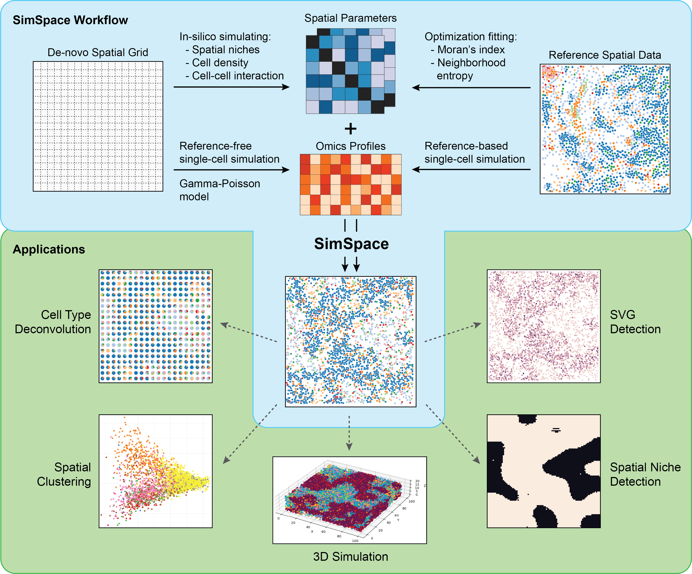

# SimSpace

[](https://simspace.readthedocs.io/en/latest/)
[](https://pypi.org/project/simspace/)
[](https://doi.org/10.1101/2025.07.18.665587) 

**SimSpace** is a Python framework for generating spatial omics data with
controllable tissue niches, cell-type organization, and molecular profiles.
Version 0.4.1 provides both a Python API and a headless command-line interface
for reference-free and reference-based simulations.



## Installation

We recommend using the supplied `environment.yml` to create a Conda environment
for SimSpace:

```bash
git clone https://github.com/TianxiaoNYU/simspace.git
cd simspace
conda env create -f environment.yml
conda activate simspace
```

Install the released SimSpace package in this environment:

```bash
python -m pip install simspace
```

### Optional R dependencies

The native molecular-profile generator does not require R. To run the optional
scDesign3, SRTsim, or Splatter adapters in either SimSpace or the manuscript
reproducibility workflows, install the corresponding R packages once in your
normal local R environment. Do not create a separate R virtual environment.
See [Optional R molecular-profile adapters](#optional-r-molecular-profile-adapters)
for the local installation commands.

## Command-line quick start

### Reference-free simulation

This command generates a new spatial layout and native Gamma--Poisson molecular
profiles without a reference dataset:

```bash
simspace reference-free \
  --output-dir results/reference_free \
  --shape 100 100 \
  --n-niches 3 \
  --n-cell-types 8 \
  --neighbor-distance 3 \
  --cell-sweeps 4 \
  --niche-sweeps 6 \
  --jitter 0.2 \
  --n-genes 100 \
  --bg-ratio 0.6 \
  --lr-ratio 0.2 \
  --bg-param 1 0.5 \
  --marker-param 5 1.6 \
  --seed 42
```

Use `simspace reference-free --help` to see all supported options. To reuse or
edit an existing spatial design, replace the random-parameter options with
`--params parameters.json`.

### Reference-based simulation

Reference-based simulation requires cell metadata with two numeric coordinate
columns and one categorical cell-type column. A previously fitted parameter
file gives the shortest workflow:

```bash
simspace reference-based \
  --reference-metadata data/reference_metadata.csv \
  --cell-type-column Cluster \
  --x-column x_centroid \
  --y-column y_centroid \
  --params data/fitted_params.json \
  --profile-model native \
  --shape 100 100 \
  --n-genes 100 \
  --output-dir results/reference_based \
  --seed 42
```

To calibrate spatial parameters from the supplied metadata instead, replace
`--params ...` with, for example:

```bash
--fit-spatial --n-niches 2 --population-size 20 --generations 10
```

Calibration can be time-consuming, so the command requires an explicit choice
between `--params` and `--fit-spatial`.

By default, `--profile-model native` generates Gamma--Poisson profiles after
the reference-based spatial layout is created. To fit molecular profiles from
a reference matrix, supply `--reference-counts` and select `scdesign3` or
`srtsim`; these two adapters require their corresponding R packages. The
scDesign3 adapter automatically uses negative-binomial marginals for
integer-valued counts and log-Gaussian marginals for nonnegative continuous
intensities. Use `--scdesign-family nb` or `--scdesign-family gaussian` to
override that detection when the measurement type is known.

## Output files

Every successful command writes the same four files:

```text
results/reference_free/
├── metadata.csv
├── molecular_profiles.csv.gz
├── spatial_scatter.png
└── parameters.json
```

| File | Contents |
|---|---|
| `metadata.csv` | One row per cell with `cell_id`, `x`, `y`, `niche`, and `cell_type` |
| `molecular_profiles.csv.gz` | One row per cell and one column per molecular feature, linked by `cell_id` |
| `spatial_scatter.png` | Headless scatterplot of the simulated cell-type distribution |
| `parameters.json` | Exact generated, supplied, or fitted spatial parameters for reuse |

Example metadata:

```text
cell_id,x,y,niche,cell_type
cell_000001,-0.04,0.17,1,CellType_3
cell_000002,0.91,-0.05,1,CellType_1
cell_000003,1.88,0.00,0,CellType_3
```

For two-dimensional simulations, `x` is the horizontal coordinate (the
Python object's `col`) and `y` is the vertical coordinate (`row`). The cell
IDs and row order are identical in the metadata and molecular-profile files.
Existing output files are protected unless `--overwrite` is supplied.

## Which parameters should I change?

| Goal | Main options |
|---|---|
| Change tissue size | `--shape ROWS COLS` |
| Change organizational complexity | `--n-niches`, `--n-cell-types` |
| Change local spatial scale | `--neighbor-distance`, `--neighbor-method` |
| Change sampling depth | `--cell-sweeps`, `--niche-sweeps` |
| Change cell retention and coordinate displacement | `--density-min`, `--density-max`, `--jitter` |
| Change reference-free affinity ranges | `--theta-max`, `--niche-theta-max`, `--phi-min`, `--phi-max` |
| Change molecular feature composition | `--n-genes`, `--bg-ratio`, `--lr-ratio`, `--bg-param`, `--marker-param` |
| Change reference calibration | `--population-size`, `--generations`, `--mutation-rate`, `--crossover-rate`, `--replicates` |

Positive affinity values favor local co-occurrence, negative values favor
separation, and the `phi` range controls overall spatial smoothness. Use a
saved `parameters.json` when exact affinities or densities should be edited
directly.

## Design a reference-free parameter JSON

For a complete guide to the six-field JSON schema, affinity-vector ordering,
a runnable hand-designed example, parameter-tuning checks, and the additional
custom geometry used for the cortex-inspired manuscript Figure 3, see
[Designing reference-free SimSpace parameter JSON files](REFERENCE_FREE_PARAMETER_README.md).

The guide also explains an important boundary: a standard `--params` file
controls niche and cell-type affinities, density, and MRF smoothness, whereas
tissue masks, curved niche boundaries, named cell types, colors, and custom
marker programs are supplied through the Python workflow.

## Background and batch execution

The CLI is noninteractive and uses headless plotting, so either simulation
mode can run under `nohup`, a shell script, or a cluster scheduler:

```bash
mkdir -p logs
nohup simspace reference-free \
  --output-dir results/run_01 \
  --shape 100 100 \
  --n-niches 3 \
  --n-cell-types 8 \
  --n-genes 1000 \
  --seed 42 \
  > logs/run_01.log 2>&1 &
```

The process returns exit status `0` on success and a nonzero status with an
error message on failure. The same approach applies to `reference-based`.

## Python API quick start

The existing Python interface remains unchanged:

```python
from simspace import spatial, util

params = util.generate_random_parameters(n_group=3, n_state=8, seed=42)
sim = util.sim_from_params(
    params,
    shape=(50, 50),
    custom_neighbor=spatial.generate_offsets(3, "manhattan"),
    seed=42,
)
sim.create_omics(n_genes=100)
sim.plot()
```

Advanced direct spatial-expression and observation-effect controls remain
available through `SimSpace.create_omics()` in the Python API.

For selected genes, the direct spatial layer uses a finite-basis specialization
of the regression fixed-effect mean summarized by
[Yan et al. (2025)](https://doi.org/10.1038/s41467-025-56080-w), with
[spVC](https://doi.org/10.1186/s13059-024-03245-3) providing the closest
primary precedent. SimSpace uses this structure for efficient generation and
truth export; it does not reproduce those methods' inferential procedures.
Under treatment coding, `overall_coefficients` supplies the spatial surface
shared across cell types and therefore the total surface for `reference_state`,
while `cell_type_coefficients` adds cell-type-by-space deviations. A
non-reference cell type's total surface is the sum of the shared surface and
its deviation. The
interaction for `reference_state` must be zero or omitted
for identifiability; the current native library-size factor is one. For
example, this adds an overall row gradient to `Gene_0` and an additional
column gradient in cell type 1 relative to reference cell type 0:

```python
sim.create_omics(
    n_genes=100,
    spatial=False,
    direct_spatial_effects={
        "genes": ["Gene_0"],
        "basis": "linear",
        "overall_coefficients": {"Gene_0": [0.5, 0.0]},
        "cell_type_coefficients": {"Gene_0": {1: [0.0, 0.75]}},
        "reference_state": 0,
    },
)
```

The older `coefficients` key remains an alias for `overall_coefficients`, so
existing configurations and same-seed outputs are unchanged.

## Tutorials and documentation

- [Tutorial guide](tutorials.md)
- [Executable notebooks](tutorials/)
- [Full documentation](https://simspace.readthedocs.io/en/latest/)
- [Manuscript reproducibility repository](https://github.com/TianxiaoNYU/simspace-reproducibility)

The notebooks provide step-by-step explanations but are not required for
command-line execution.

## Optional R molecular-profile adapters

SimSpace supports scDesign3, SRTsim, and Splatter as optional molecular-profile
generators. Install these packages once in your normal local R environment;
no separate R virtual environment is required.

1. Install R 4.4 or a compatible version from
   [CRAN](https://cran.r-project.org/).
2. In the local R session, install scDesign3 and SRTsim:

```r
if (!require("devtools", quietly = TRUE))
    install.packages("devtools")

devtools::install_github("SONGDONGYUAN1994/scDesign3")
devtools::install_github("xzhoulab/SRTsim")
```

3. Install Splatter if that adapter is needed:

```r
if (!require("BiocManager", quietly = TRUE))
    install.packages("BiocManager")

BiocManager::install("splatter")
```

SimSpace uses these packages from the local R installation only when the
corresponding optional adapter is requested. The native CLI molecular-profile
model does not require R.

## License and citation

SimSpace is released under the MIT License.

If you use SimSpace, please cite:

Zhao T, Zhang K, Hollenberg M, Zhou W, Fenyo D. *SimSpace: a comprehensive
in-silico spatial omics data simulation framework.* bioRxiv. 2025.
[doi:10.1101/2025.07.18.665587](https://doi.org/10.1101/2025.07.18.665587)

Questions can be directed to Tianxiao Zhao at Tianxiao.Zhao@nyulangone.org.
